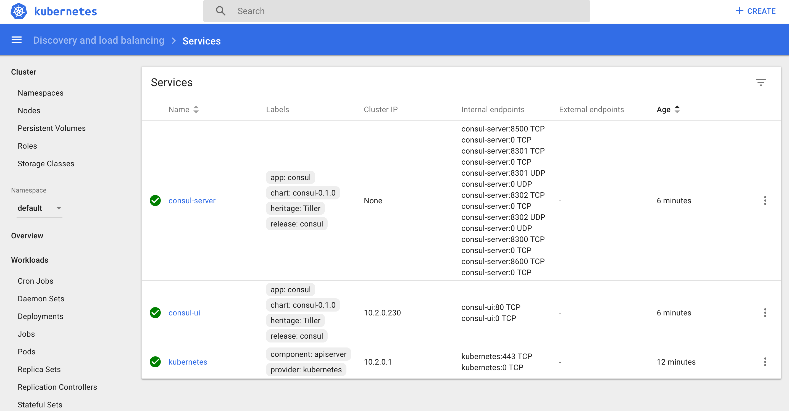
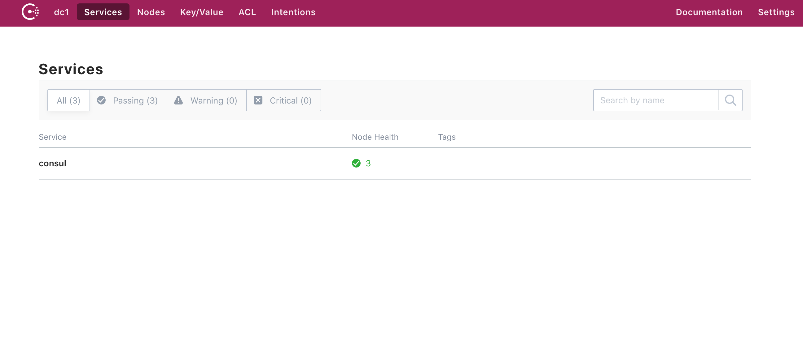

# Consul Connect Demo on Kubernetes

This demo shows how connect can be used in a multi-tier microservice environment

## Architecture
The application is comprised of 5 microservices and two data stores
1. Nginx Ingress for Kubernetes with SSL certificates
1. Web Frontend (React, browser based) - Public
1. API Service (Golang) - Public
1. OAuth service (Keratin) - Public
1. Cache Service backed by cloud storage (Golang) - Private
1. Face detection service (Machinebox) - Private
1. Redis - Private
1. Postgres - Private

The microservices are running in a pod which uses the auto inject feature of Consul Connect on Kubernetes to auto create the Envoy proxy sidecar 

To route requests to the frontend and api microservices a router is sitting behind a public loadbalancer.  The router is using the Connect Go SDK to proxy requests to the upstream services.

Every node in the Kubernetes cluster has a Consul Agent running which is accessible via the Node IP adddress.  Currently the Consul server is running as a single instance however ultimately this will be moved out to a separate cluster not managed by Kubernetes.

To register the services with the Consul Service Catalog, Consul Register is running, Register monitors the Kubernetes cluster and when a pod starts it automatically registers the containers with Consul.


## Applications

### Emojify Frontend
GitHub: [http://github.com/nicholasjackson/emojify-frontend](http://github.com/nicholasjackson/emojify-frontend)

Docker: nicholasjackson/emojify-frontend

The frontend application is a simple browser based ReactJS application, it leverages the API, posting the URL of an image to be processed and presenting the returned image.  The frontend expects the API to be accessible on the same IP as the website at the `api` path.

### Emojify API
GitHub: [http://github.com/nicholasjackson/emojify-api](http://github.com/nicholasjackson/emojify-api)

Docker: nicholasjackson/emojify-api

The API server accepts POST requests with the body containing a url to an image, the server downloads the image from the URL and sends it to the face detection service for processing.  When the response from the face detection service is received the service overlays random emoji at the location of the detected faces, saves the result as a PNG and returns a URL where the image can be retrieved in the response.

### Face detection service
[www.machinebox.io](http://www.machinebox.io)

<small>
	Artificial Intelligence powered by <a href='https://machinebox.io/' target='_blank'>Machine Box</a>
</small>

To detect faces an image is sent to the `Facebox` instance, this is a 3rd party black box service.

### Consul Connect Router
GitHub [http://github.com/nicholasjackson/consul-connect-router](http://github.com/nicholasjackson/consul-connect-router)

Docker: nicholasjackson/consul-connect-router

To route requests from the private kubernetes cluster to the private data network segment the Consul Connect Router project is used.  This service uses the  Connect Go SDK which allows requests to be transparently and securely proxied to the upstream services.


## Setup
The example project runs on Kubernetes, currently the example Terraform will create a cluster in Azure.

### Install the helm provider

```bash
make install_helm_provider
```

### Install the helm client

```bash
brew install helm
```

### Init helm client
```
helm init -client
```

### Configure environment variables
You will need to set the following environment variables which correspond to your account in azure

```bash
# Set your Azure credentials 
export ARM_SUBSCRIPTION_ID=xxxxxxxx
export ARM_CLIENT_ID=xxxxxxxx
export ARM_CLIENT_SECRET=xxxxxxxx
export ARM_TENANT_ID=xxxxxxx

export TF_VAR_client_id=${ARM_CLIENT_ID}
export TF_VAR_client_secret=${ARM_CLIENT_SECRET}
export TF_VAR_tennant_id=${ARM_TENANT_ID}

# Machine Box API Key, get a free developer account from https://machinebox.io/
export TF_VAR_machinebox_key=xxxxxxxxx

# Optionally create a CloudFlare CDN, set TF_VAR_cloudflare_enabled=false if not using CloudFlare
export TF_VAR_cloudflare_enabled=true
export CLOUDFLARE_EMAIL=your@email.address
export CLOUDFLARE_TOKEN=xxxxxxxx
export TF_VAR_cloudflare_domain=domain_zone_maps_to.com
export TF_VAR_cloudflare_zone_id="yourzone_id"

# Optionally enable Github Auth, see GitHub auth section for help
export TF_VAR_github_auth_enabled=true
export TF_VAR_github_auth_client_id=xxxxxxxx
export TF_VAR_github_auth_client_secret=xxxxxxxxxx

# Email address for lets encyrpt
export TF_VAR_letsencrypt_email="your@email.address"
```

## Remote State
The application uses Terraform remote state with the Azure backend, to configure the variables required for remotestate run the command `make setup_remote_state`. You will be prompted for your remote state values, which will be written to the files remotestatebackend.tfvars and remotestatedata.tfvars.

```bash
make setup_remote_state
```

## Core infrastructure
The application is broken into two components, the core infrastructure consists of the Kubernetes cluster with running Consul server, and a Vault instance.

The core infrastructure takes approximately 10 minutes to provision.

### Create k8s cluster and provision application with Helm
To create the cluster on Azure use the Terraform configuration to create a basic cluster.

```bash
make apply_core
```

### Open dashboard
To view the Kubernetes dashboard we can start the Kube proxy and then open the dashboard in a browser

```bash
make open_dashboard
```


### Login to the jumpbox
There is a bastion host or jumpbox configured which you can use to access `kubectl` and interact with `HashiCorp Vault`, to ssh into this machine use the following command.

```
make ssh_jumpbox
```

### View the Consul UI
To view the consul UI you can port forward to the clusters consul-server

```bash
make open_consul_ui
```



### Fetch K8s config
Once the cluster has been created the configuration which allows connections with `kubectl` can be retrieved with the following script.

```bash
make get_k8s_config
```
We can then set an environment variable pointing to the downloaded configuration

```bash
export KUBECONFIG=$(pwd)/kube_config.yml
```

You can now use `kubectl` to interact with the cluster

## Application infrastructure
To install the application and create its required infrastructure perform the following steps, this will take approximately 20 minutes to complete as it can take a reasonable amount of time to create the Redis cluster in Azure.

### Installing the application
To install and run the application first ensure you have created the core infrastructure then run

```bash
make apply_emojify
```

### Open application frontpage

```bash
make open_emojify
```


## TODO
[] Implement Consul ACLs to correctly secure the Consul Agents and Proxies  
